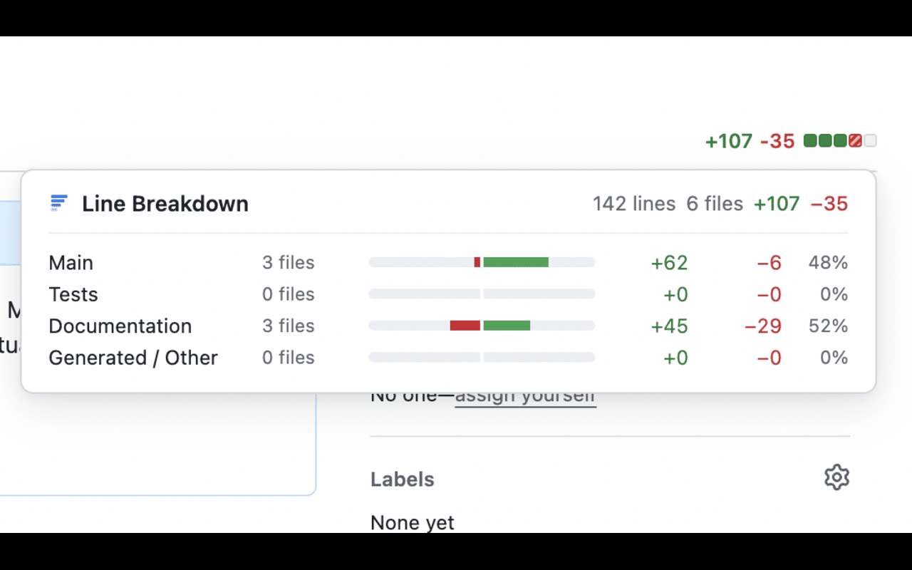

# GitHub PR Line Breakdown

[](https://chromewebstore.google.com/detail/github-pr-line-breakdown/llfndpapjbmogegbhbbjckaimmlpjgkc)
[](https://chromewebstore.google.com/detail/github-pr-line-breakdown/llfndpapjbmogegbhbbjckaimmlpjgkc)

A Chrome extension that shows a line-count breakdown widget on GitHub PR pages, categorizing changed lines into configurable buckets (Tests, Documentation, Generated, Main) based on glob patterns.




## How it works

The extension fetches the list of changed files from the GitHub REST API and classifies each file against your configured categories using glob patterns. The results appear as a hover popup anchored to the native `+N -N ████` diffstat shown in the PR header — visible on every PR tab (Conversation, Commits, Checks, Files Changed).

The popup header shows the total line and file counts across all categories. Each category row shows its file count, a proportional bar chart, added/removed line counts, and a percentage of total lines changed.

Files are classified into categories evaluated in order — the first matching glob pattern wins. Default categories:

| Category              | Matches                                                                                              |
| --------------------- | ---------------------------------------------------------------------------------------------------- |
| **Main** (fallback)   | Everything else                                                                                      |
| **Tests**             | `*.spec.ts`, `*.test.ts`, `*.spec.tsx`, `*.test.tsx`, `__tests__/**`, `test_*.py`, `*_test.py`, etc. |
| **Documentation**     | `*.md`, `*.rst`, `*.svg`, `docs/**`, images, diagrams                                                |
| **Generated / Other** | Lock files, `*.snap`, `dist/**`, `build/**`, `.next/**`, Python bytecode                             |

Categories can be added, removed, reordered, and edited from the extension options page. Changes take effect immediately on the next PR page load.

By default, unauthenticated API calls are limited to **60 requests/hour**. For private repos or heavy usage, add a GitHub token in the extension options (click the icon → **Open Options**). Generate one at [GitHub Settings → Developer settings → Personal access tokens](https://github.com/settings/tokens) — use `repo` scope for private repos, no scope for public only. The token is stored locally in your browser and never synced.

## Getting Started

### Install from the Chrome Web Store

The easiest way to get started is to install directly from the Chrome Web Store:

**[→ Install GitHub PR Line Breakdown](https://chromewebstore.google.com/detail/github-pr-line-breakdown/llfndpapjbmogegbhbbjckaimmlpjgkc)**

### Build from source

**Prerequisites**

- [Node.js](https://nodejs.org/) 18+
- npm

**Quick start**

```bash
git clone https://github.com/gjeanmart/github-line-breakdown-extension.git
cd github-line-breakdown-extension
npm install
npm run build   # outputs to dist/
```

Then load the unpacked extension in Chrome:

1. Open `chrome://extensions`
2. Enable **Developer mode** (top right)
3. Click **Load unpacked** and select the `dist/` folder

**Run tests**

```bash
npm run test    # vitest unit tests
```

## Releasing a new version

Releases are fully automated via GitHub Actions on version tags.

### Steps

1. Make sure all changes are merged into `main` and CI is green
2. Bump the version in `package.json` and `manifest.json` to the new version (e.g. `1.1.0`)
3. Commit and push:
   ```bash
   git add package.json manifest.json
   git commit -m "chore: bump version to v1.1.0"
   git push origin main
   ```
4. Tag and push:
   ```bash
   git tag v1.1.0
   git push origin v1.1.0
   ```

The `release` GitHub Actions workflow will then automatically:

- Run tests
- Sync the version from the tag into `package.json` and `manifest.json`
- Build the extension
- Package `dist/` as `gh-pr-line-breakdown-v1.1.0.zip`
- Create a GitHub Release with the zip attached and auto-generated release notes
- Publish to the Chrome Web Store (if `CHROME_EXTENSION_ID`, `CHROME_CLIENT_ID`, `CHROME_CLIENT_SECRET`, and `CHROME_REFRESH_TOKEN` secrets are set in the repo — otherwise the zip is attached to the GitHub Release for manual upload)

## Tech stack

- TypeScript, Vite 5, vitest
- Vanilla DOM (no UI framework)
- Custom glob matcher (no runtime dependencies in the content script)
- Shadow DOM for widget isolation (styles fully isolated from GitHub's page)
- `chrome.storage.sync` for category config, `chrome.storage.local` for the token
