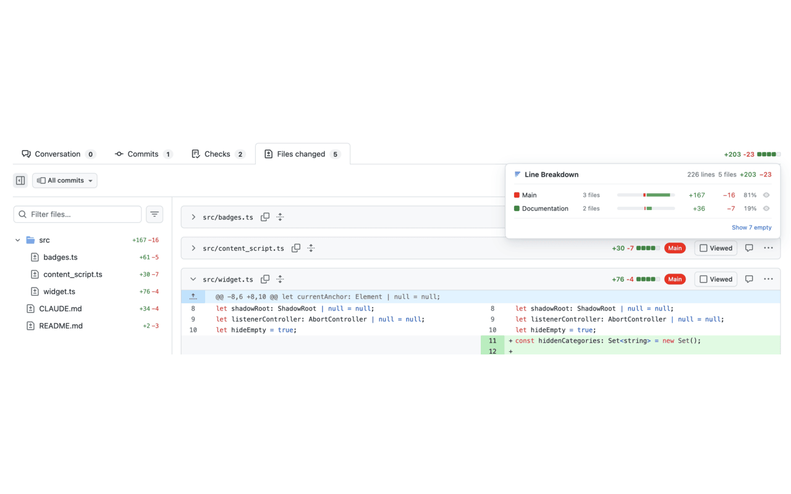

# GitHub PR Line Breakdown

[](https://chromewebstore.google.com/detail/github-pr-line-breakdown/llfndpapjbmogegbhbbjckaimmlpjgkc)
[](https://chromewebstore.google.com/detail/github-pr-line-breakdown/llfndpapjbmogegbhbbjckaimmlpjgkc)

A Chrome extension that shows a line-count breakdown widget on GitHub PR pages, categorizing changed lines into configurable buckets (Tests, Documentation, Generated, Main) based on glob patterns. Each category has a configurable color, shown as a pill badge on every file diff header and as a color swatch in the widget and popup. Click the eye icon on any category row to collapse all matching files in the Files Changed tab — keeping headers visible for context.



## How it works

The extension fetches the list of changed files from the GitHub REST API and classifies each file against your configured categories using glob patterns. The results appear as a hover popup anchored to the native `+N -N ████` diffstat shown in the PR header — visible on every PR tab (Conversation, Commits, Checks, Files Changed).

The popup header shows the total line and file counts across all categories. Each category row shows its file count, a proportional bar chart, added/removed line counts, a percentage of total lines changed, and an eye icon to collapse/expand all matching files in the Files Changed tab.

On the Files Changed tab, `+N −N` line counts are also injected directly into the PR file tree sidebar next to every file and folder. Folder counts roll up all files underneath them.

Files are classified into categories evaluated in order — the first matching glob pattern wins. Default categories:

| Category              | Matches                                                                                                 |
| --------------------- | ------------------------------------------------------------------------------------------------------- |
| **Main** (fallback)   | Everything else                                                                                         |
| **Tests**             | `*.spec.ts`, `*.test.ts`, `*.spec.tsx`, `*.test.tsx`, `__tests__/**`, `test_*.py`, `*_test.py`, etc.    |
| **Documentation**     | `*.md`, `*.rst`, `*.svg`, `docs/**`, images, diagrams                                                   |
| **Generated / Other** | Lock files, `*.snap`, `dist/**`, `build/**`, `.next/**`, Python bytecode                                |
| **CI/CD**             | `.github/workflows/**`, `.circleci/**`, `Dockerfile*`, `docker-compose*`, `.travis.yml`, etc.           |
| **Infrastructure**    | `*.tf`, `*.tfvars`, `k8s/**`, `kubernetes/**`, `helm/**`, `charts/**`                                   |
| **Config**            | `.eslintrc*`, `.prettierrc*`, `tsconfig*.json`, `vite.config.*`, `.editorconfig`, `renovate.json`, etc. |
| **Database**          | `migrations/**`, `db/migrate/**`, `seeds/**`, `fixtures/**`, `*.sql`                                    |
| **Styles**            | `*.css`, `*.scss`, `*.sass`, `*.less`, `styles/**`, `themes/**`                                         |

The options page (click the extension icon → **Open Options**) has two tabs:

- **Categories** — add, remove, reorder (drag and drop), edit glob patterns, and pick a color per category. The color is displayed as a pill badge on each file diff header and as a small swatch in the hover widget and popup. Changes take effect on the next PR page load.
- **Settings** — GitHub token, and import/export of your category config as JSON.

You can **export** your categories to a JSON file to back them up or share them across browsers. **Importing** a file replaces your current categories — you can review the result before saving. The GitHub token is never included in exports.

By default, unauthenticated API calls are limited to **60 requests/hour**. For private repos or heavy usage, add a GitHub token in **Settings**. Generate one at [GitHub Settings → Developer settings → Personal access tokens](https://github.com/settings/tokens) — use `repo` scope for private repos, no scope for public only. The token is stored locally in your browser and never synced.

## Planned features

- **Firefox support** — publish to the Firefox Add-ons Marketplace (AMO)
- **Category pills on PR list pages** — inject mini colored category pills on GitHub's PR list view so you can see the file-type composition of a PR before opening it
- **LLM integration** — connect to a cloud (OpenAI, Anthropic, etc.) or local (Ollama) LLM for AI-assisted review: category-aware PR summaries, review focus suggestions, inline comment proposals, and risk flagging. Configurable endpoint and API key in the Settings tab
- **GitHub classic experience support** — the extension currently only works with GitHub's new (Primer React) UI; add fallback selectors to support the classic GitHub experience
- **GitLab support** — bring the same breakdown widget and file badges to GitLab merge request pages (`gitlab.com` and self-hosted instances)
- **Gitea / Forgejo support** — extend to self-hosted Gitea and Forgejo instances, with configurable instance URLs in Settings
- **Repo-specific config** — define different category rules per repository
- **UI/UX polish** — design improvements to the widget and options page

## Getting Started

### Install from the Chrome Web Store

The easiest way to get started is to install directly from the Chrome Web Store:

**[→ Install GitHub PR Line Breakdown](https://chromewebstore.google.com/detail/github-pr-line-breakdown/llfndpapjbmogegbhbbjckaimmlpjgkc)**

### Build from source

**Prerequisites**

- [Node.js](https://nodejs.org/) 18+
- npm

**Quick start**

```bash
git clone https://github.com/gjeanmart/github-line-breakdown-extension.git
cd github-line-breakdown-extension
npm install
npm run build   # outputs to dist/
```

Then load the unpacked extension in Chrome:

1. Open `chrome://extensions`
2. Enable **Developer mode** (top right)
3. Click **Load unpacked** and select the `dist/` folder

**Run tests**

```bash
npm run test    # vitest unit tests
```

## Releasing a new version

Releases are fully automated via GitHub Actions on version tags.

### Steps

1. Make sure all changes are merged into `main` and CI is green
2. Run the release script:
   ```bash
   npm run release 1.1.0
   ```
   This will run tests, bump the version in `package.json` and `manifest.json`, commit, tag, and push everything to `main`.

The `release` GitHub Actions workflow will then automatically:

- Run tests
- Sync the version from the tag into `package.json` and `manifest.json`
- Build the extension
- Package `dist/` as `gh-pr-line-breakdown-v1.1.0.zip`
- Create a GitHub Release with the zip attached and auto-generated release notes
- Publish to the Chrome Web Store (if `CHROME_EXTENSION_ID`, `CHROME_CLIENT_ID`, `CHROME_CLIENT_SECRET`, and `CHROME_REFRESH_TOKEN` secrets are set in the repo — otherwise the zip is attached to the GitHub Release for manual upload)

## Tech stack

- TypeScript, Vite 5, vitest
- Vanilla DOM (no UI framework)
- Custom glob matcher (no runtime dependencies in the content script)
- Shadow DOM for widget isolation (styles fully isolated from GitHub's page)
- `chrome.storage.sync` for category config, `chrome.storage.local` for the token
