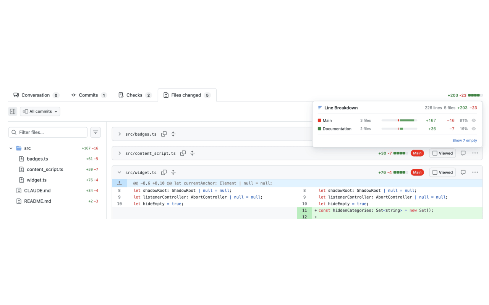

# GitHub PR Line Breakdown

[](https://chromewebstore.google.com/detail/github-pr-line-breakdown/llfndpapjbmogegbhbbjckaimmlpjgkc)
[](https://chromewebstore.google.com/detail/github-pr-line-breakdown/llfndpapjbmogegbhbbjckaimmlpjgkc)

A Chrome extension that shows a line-count breakdown widget on GitHub PR pages, categorizing changed lines into configurable buckets (Tests, Documentation, Generated, Main) based on glob patterns. Each category has a configurable color, shown as a pill badge on every file diff header and as a color swatch in the widget and popup. Click the eye icon on any category row to collapse all matching files in the Files Changed tab — keeping headers visible for context.



## How it works

The extension fetches the list of changed files from the GitHub REST API and classifies each file against your configured categories using glob patterns. The results appear as a popup anchored to the native `+N -N ████` diffstat — point at that diffstat to open it, or **click it to pin the popup open** (click again, or press Escape, to close). It works on every PR tab (Conversation, Commits, Checks, Files Changed) and on commit pages (`/commit/{sha}`), and it follows your GitHub theme, including the dimmed and high-contrast variants.

The popup header shows the total line and file counts across all categories. Each category row shows its file count, a proportional bar chart, added/removed line counts, a percentage of total lines changed, and an eye icon to collapse/expand all matching files in the Files Changed tab.

On the Files Changed tab, `+N −N` line counts are also injected directly into the file tree sidebar next to every file and folder. Folder counts roll up all files underneath them.

The popup footer has a **Copy markdown** button, which puts the breakdown on your clipboard as a table ready to paste into a PR description or a review comment. **By order / By size** switches between category order — which is matching precedence — and biggest-first.

The eye icon on each row collapses that category's files in the diff. **⌥-click** (Alt elsewhere) hides everything *except* that category, and **Show all** brings them back. Whatever you hide is remembered for that PR, so coming back to a review picks up where you left off. The toolbar popup has the same eye icons and drives the same filter.

Everything is reachable from the keyboard: the diffstat is focusable, Enter or Space pins the popup open, and Escape closes it.

If the breakdown can't be loaded — a rate limit, or a private repo without a token — a small red dot appears on the diffstat; hover it for the reason, and for a link straight to the token field. Without a token GitHub allows 60 API calls an hour, so when you get close the widget and popup start telling you how many are left and when the hour resets. The **Settings** tab shows the number at any time, along with your ceiling — check it after adding a token to confirm the token works.

Files are classified into categories evaluated in order — the first matching glob pattern wins. Default categories:

| Category              | Matches                                                                                                 |
| --------------------- | ------------------------------------------------------------------------------------------------------- |
| **Main** (fallback)   | Everything else                                                                                         |
| **Tests**             | `*.spec.ts`, `*.test.ts`, `*.spec.tsx`, `*.test.tsx`, `__tests__/**`, `test_*.py`, `*_test.py`, etc.    |
| **Documentation**     | `*.md`, `*.rst`, `*.svg`, `docs/**`, images, diagrams                                                   |
| **Generated / Other** | Lock files, `*.snap`, `dist/**`, `build/**`, `.next/**`, Python bytecode                                |
| **CI/CD**             | `.github/workflows/**`, `.circleci/**`, `Dockerfile*`, `docker-compose*`, `.travis.yml`, etc.           |
| **Infrastructure**    | `*.tf`, `*.tfvars`, `k8s/**`, `kubernetes/**`, `helm/**`, `charts/**`                                   |
| **Config**            | `.eslintrc*`, `.prettierrc*`, `tsconfig*.json`, `vite.config.*`, `.editorconfig`, `renovate.json`, etc. |
| **Database**          | `migrations/**`, `db/migrate/**`, `seeds/**`, `fixtures/**`, `*.sql`                                    |
| **Styles**            | `*.css`, `*.scss`, `*.sass`, `*.less`, `styles/**`, `themes/**`                                         |

The options page (click the extension icon → **Open Options**) has two tabs:

- **Categories** — add, remove, reorder (drag and drop), edit glob patterns, and pick a color per category. The color is displayed as a pill badge on each file diff header and as a small swatch in the hover widget and popup; badge text is black or white depending on which reads better against your color. Saved changes apply immediately to any open PR or commit page — no reload needed.
- **Settings** — GitHub token, and import/export of your category config as JSON.

You can **export** your categories to a JSON file to back them up or share them across browsers. **Importing** a file replaces your current categories — you can review the result before saving. The GitHub token is never included in exports.

By default, unauthenticated API calls are limited to **60 requests/hour**, and one large PR can cost 30 of them. For private repos or heavy usage, add a GitHub token in **Settings**.

Prefer a [**fine-grained** personal access token](https://github.com/settings/personal-access-tokens/new) with **read-only** access to *Contents* and *Pull requests*, scoped to the repositories you actually review. That is everything this extension can use. A classic `repo`-scoped token would also grant write access to every repository you can reach — far more than is needed here, and worth avoiding for something running inside a web page.

The token is stored in `chrome.storage.local`, so it stays on this machine and is never synced to your other browsers, never included in config exports, and only ever sent to `api.github.com` — the API client refuses to attach it to any other origin.

## Roadmap

Ordered, not a wish list. Each release has a reason to come when it does, and the two ordering
constraints are called out where they apply.

### v0.1.9 — pay the debt, then finish the widget · **complete, awaiting release**

Three internal fixes first — the filename → header map extracted into `src/file_headers.ts`
with its contract, one stylesheet for everything injected into GitHub, and a `--dry-run` for
the release script — then five features on the surface they sit under: sort by size, filter
shortcuts, filtering from the popup, keyboard access, and a filter remembered per PR.

1. **Extract the filename → header map** — three separate bugs have come from callers
   disagreeing about what that map holds (a dead eye icon, a badge that jumped sides,
   duplicate badges). It needs its own module with the contract written down.
2. **One styling idiom for injected surfaces** — badges and tree counts are styled with
   `cssText` strings while the widget has a stylesheet; two of the features below add UI to
   those same surfaces.

### v0.2.0 — configuration that fits real repos

- **Repo-specific config** — per-repo overrides need a storage schema, a resolution order
  (repo → owner → default) and UI for all three. Import/export and the options page change
  with it, which is why it comes before anything else that touches config.
  **Its storage keys must include the host from day one**, even though only GitHub exists —
  otherwise the multi-host work below means migrating every stored config.
- **Exclude a category from the totals** — a 4,000-line lockfile currently drowns the
  percentages that make the breakdown worth reading. Still counted, still badged, not in the
  denominator.
- **Show which pattern matched a file** — when a file lands in a surprising category there is
  no way to find out why. Clicking a badge should say which glob caught it.
- **Consolidate the types** — worth doing while the config schema is already moving.

### v0.2.x — arriving from the store

- **First-run experience** — install it today and nothing happens until you find a PR: no
  welcome, no token prompt, no mention of the 60-calls-an-hour ceiling many users meet on day
  one.
- **UI/UX polish** — genuinely worth doing once the widget's feature set has stopped moving.

### v0.3.0 — more than one host

Three roadmap items are the same work done once instead of three times.

- **Provider interface** — abstract the host-specific API client and DOM injection so
  `content_script.ts` stays provider-agnostic. Worth landing on its own, with GitHub as the
  only implementation, so the refactor is reviewable separately from the new hosts.
- **GitHub Enterprise** — the cheapest provider: same API, same DOM, different host. It
  validates the abstraction before a genuinely different one lands.
- **GitLab** — different API shape and different DOM: the real test of the interface.
  `GET /projects/:id/merge_requests/:iid/changes`.
- **Gitea / Forgejo** — closest to GitHub's API of the three, so cheap once the seam exists.

### v0.4.0 — a second browser

- **Firefox / AMO** — a `browser.*` shim, a second manifest, a third build pass and a second
  store listing. Deliberately late: every UI change made before this point would otherwise
  need testing twice, in two stores, with two review queues.

### Not scheduled

- **Category pills on PR list pages** — needs a fetch per visible PR row against a
  60-an-hour ceiling. Reasonable only with aggressive caching and a token, so it wants the
  first-run work first.
- **LLM integration** — category-aware PR summaries, review focus suggestions, risk flagging.
  The open question is not the plumbing but whether a breakdown plus file paths is enough
  context to say anything a reviewer could not see faster themselves. Worth a throwaway
  prototype before it becomes a roadmap item.

### Dropped

- **GitHub classic experience support** — a second set of DOM selectors for every injected
  surface, maintained forever, for a UI GitHub is retiring. Those selectors are already the
  most fragile code in the project.

## Getting Started

### Install from the Chrome Web Store

The easiest way to get started is to install directly from the Chrome Web Store:

**[→ Install GitHub PR Line Breakdown](https://chromewebstore.google.com/detail/github-pr-line-breakdown/llfndpapjbmogegbhbbjckaimmlpjgkc)**

### Build from source

**Prerequisites**

- [Node.js](https://nodejs.org/) 18+
- pnpm

**Quick start**

```bash
git clone https://github.com/gjeanmart/github-line-breakdown-extension.git
cd github-line-breakdown-extension
ppnpm install
ppnpm run build   # outputs to dist/
```

Then load the unpacked extension in Chrome:

1. Open `chrome://extensions`
2. Enable **Developer mode** (top right)
3. Click **Load unpacked** and select the `dist/` folder

**Run tests**

```bash
pnpm test       # vitest unit tests
```

## Releasing a new version

Releases are fully automated via GitHub Actions on version tags.

### Steps

1. Make sure all changes are merged into `main` and CI is green
2. Run the release script:
   ```bash
   pnpm run release 1.1.0 --dry-run   # rehearse first: every check, no changes
   pnpm run release 1.1.0
   ```
   This will run tests, bump the version in `package.json` and `manifest.json`, commit, tag, and push everything to `main`.

The `release` GitHub Actions workflow will then automatically:

- Run tests
- Sync the version from the tag into `package.json` and `manifest.json`
- Build the extension
- Package `dist/` as `gh-pr-line-breakdown-v1.1.0.zip`
- Create a GitHub Release with the zip attached and auto-generated release notes
- Publish to the Chrome Web Store (if `CHROME_EXTENSION_ID`, `CHROME_CLIENT_ID`, `CHROME_CLIENT_SECRET`, and `CHROME_REFRESH_TOKEN` secrets are set in the repo — otherwise the zip is attached to the GitHub Release for manual upload)

## Tech stack

- TypeScript, Vite 5, vitest
- Vanilla DOM (no UI framework)
- Custom glob matcher (no runtime dependencies in the content script)
- Shadow DOM for widget isolation (styles fully isolated from GitHub's page)
- `chrome.storage.sync` for category config, `chrome.storage.local` for the token
